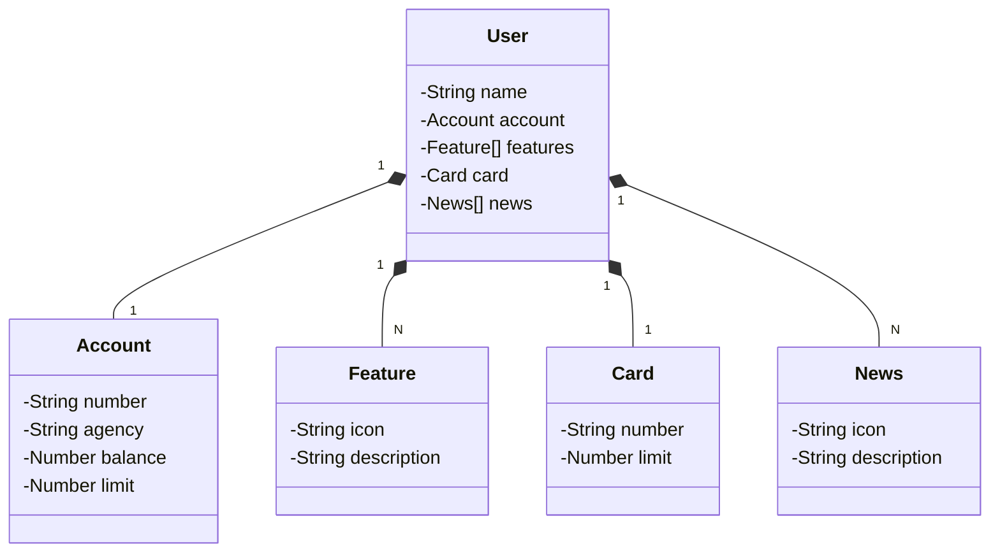

<h1>
  
  Santander API RESTful - project
</h1>

RESTful API from Santander built in Java 17 with Spring Boot 3.

## Table of Contents

- [🛠️ Key Technologies](#-key-technologies)
- [📄 API Documentation](#-api-documentation)
- [📊 UML Class Diagram](#-uml-class-diagram)
- [📑 Interface References](#-interface-references)

## 🛠️ Key Technologies

This project leverages several cutting-edge technologies:

- **Java 17** ☕: The latest LTS version of Java is used to take advantage of the newest innovations offered by this robust and widely-used language.

- **Spring Boot 3** 🚀: The latest version of Spring Boot maximizes developer productivity through its powerful autoconfiguration capabilities.

- **Spring Data JPA** 🗄️: This tool simplifies the data access layer, making integration with SQL databases more seamless.

- **OpenAPI (Swagger)** 📄: Effective and easy-to-understand API documentation is created using OpenAPI (Swagger), perfectly aligned with the high productivity that Spring Boot offers.

- **Railway** ☁️: This platform simplifies the deployment and monitoring of cloud solutions, while also providing various database-as-a-service options and CI/CD pipelines.

## 📄 API Documentation

The API documentation was created using Swagger and is available at the following link:

<a href="https://santander-restful-api-railway-prd.up.railway.app/swagger-ui/index.html" target="_blank">Swagger Documentation 🔗</a>

## 📊 UML Class Diagram

## 📑 Interface References

  
  

